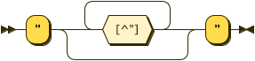

## 扩展巴科斯范式「EBNF, Extended Backus–Naur Form」

我们已经介绍了编译的基本概念，接下来我们将实现自己的第一个编程语言。在具体动手之前，让我们先了解一下，如何来对编程语言进行描述。

我们通过语法「Grammar」来定义我们的编程语言。语法的是由一组规则「Production Rules」组成的，通过这些规则可以描述递归的语法结构。

这些规则由两部分所构成：1). 规则名称 2). 规则内容。比如我们将要实现的语言「称之为 sayHi」可以表示为：

```
「say_hi」需要满足: hi 字符串
「字符串」需要满足: " 除了「"」的任意字符 "
```

在上面的语法中，我们定义了两个规则，分别是「字符串」和「say_hi」。对于规则「字符串」而言，它的规则内容为，以「"」开头，接收任除了「"」的任意字符，直到接收到「"」后结束该规则，在该规则内接收的字符串，都被打包到了我们的「字符串」规则中。

对于规则「say_hi] 而言，它的规则内容为，以关键字「hi」开头，接下来的内容将必须符合「字符串」规则。

为了更加严谨的描述我们的语法，我们需要使用各种标记语言，而扩展巴科斯范式「EBNF」就是这些标记语言中的其中一种。

通过 EBNF 可以将我们的语法表示为：

```ebnf
say_hi = "hi", string ;
string = '"' , { all characters - '"' }, '"' ;
```

可以看出，EBNF 描述规则的表达式为:

```ebnf
规则名称 = 终结符和非终结符的组合
```

终结符「Terminal Symbol」就是词法中不能被分解的最小单元，反之为非终结符「Nonterminal Symbol」。比如规则「say_hi」的右边，`"hi"` 为非终结符，而 `string` 则为非终结符。


EBNF 使用了如下的符号:

符号|含义
----|-----
= | 定义规则，左边为规则名称，右边为终结符于非终结符的组合
, | 表示连接位于其左右两边的终结符或非终结符
\| | 表示位于其左右两边的终结符或非终结符为二选一的关系
[ ... ] | 表示方括号中的(非)终结符为可选项，在该位置出现次数为 0 或 1
{ ... } | 表示大括号中的(非)终结符为重复出现的，在该位置出现次数 >= 0
( ... ) | 表示小括号中的(非)终结符在该位置以组合的形式出现
" ... " | 表示终结符
' ... ' | 表示终结符，主要用于表示 '"' 的情况
(* ... *) | 表示注释
? ... ? | 表示其中的内容具有特殊含义，对该含义的定义不在 EBNF 标准之内
\- | 表示将右边的内容从左边进行排除


接下来我们开始实现 sayHi 语言的解析，我们先总结一下 sayHi 的语法：


```ebnf
prog = { say_hi } ;
say_hi = "hi", string ;
string = '"' , { all characters - '"' }, '"' ;
```


我们增加了一条新的规则「prog」作为解析的入口。显然，我们的 sayHi 语言将只包含一条语句「Statement」类型，就是「say_hi」。

## W3C's EBNF

如果大家通过搜索引擎来检索关键字「EBNF」，那么会发现很多链接中都介绍了上文的 EBNF 语法。它是由 ISO 制定的。ISO 是一个全球化的组织，制定了很多的标准，其中也就包括了 [ISO/IEC 14977](http://standards.iso.org/ittf/PubliclyAvailableStandards/s026153_ISO_IEC_14977_1996(E).zip)，也就是上文的 EBNF 标记法。

ISO 制定 EBNF 标准的目的就是为了扩展和统一 BNF 的使用方法，因为在此之前大家在描述语法的时候，都或多或少的加入了自己的喜好，使之成了 BNF 的方言「Dialect」。

只是大家对 ISO 制定的 EBNF 标准并不满意，因为它使用起来还是很麻烦，甚至在 ISO 后来的标准制定中涉及描述语法的部分，都没有使用自家制定的「ISO/IEC 14977」。

这里我们要介绍由另一个组织 W3C 制定的 EBNF 标记法。W3C 是主要负责万维网标准制定的组织。它定义的 EBNF 标记法被自身和外界广泛使用。它的特点主要是参考了正则表达式「Regular Expression」的语法。接下来我们来一起看一下它的语法。

首先，语法中的每个规则定义一个符号「Symbol」，形式为：

```ebnf
symbol ::= expression
```

如果 Symbol 定义词法元素，比如「Token」的话，那么首字母大写；如果是定义语法元素，比如「Statement」或「Expression」的话，那么首字母小写。

规则右边的内容，也就是 expression 用来匹配一个或者多个连续的字符。可以出现在右边的表达式具有以下几种形式：

**\#xN**

单个字符。N 是一个十六进制数，整个表达式用来表示一个字符，前导的 0 可以省略，数值源于该字符在 Unicode 中的 code-point。比如，`a` 的 code-point 为 `0x61`，那么可以使用 `#x61` 来表示字符 `a`

**[a-zA-Z], [#xN-#xN]**

字符区间。表示匹配位于该区间内的任意字符，包含区间的其实和结束字符在内。

**[abc], [#xN#xN#xN]**

字符枚举。表示接下来出现的字符列举在方括号内，可以和「字符区间」写在同一个方括号内。

**[^a-z], [^#xN-#xN]**

字符区间排除。表示接下来的字符不处于区间之内。

**[^abc], [^#xN#xN#xN]**

字符枚举排除。表示接下来的字符不处于枚举之列，也可以和「字符区间排除」写在同一个方括号内。

**"string"**

匹配双引号中的字符。

**'string'**

匹配单引号中的字符。

**(expression)**

括号中的表达式被划定为一个分组。

**A?**

表示 A 出现的次数为 0 或者 1。

**A B**

表示 A 后面紧接着 B。这个操作的优先级高于交替操作 `|`，比如 `A B | C D` 等同于 `(A B) | (C D)`

**A | B**

表示 A 或者 B 交替出现于该位置

**A+**

表示一个或者多个连续出现的 A。该操作具有比交替操作 `|` 更高的优先级，比如 `A+ | B+` 等同于 `(A+) | (B+)`

**A***

表示零个或者多个连续出现的 A。该操作具有比交替操作更高的优先级。

**/\*... \*/**

表示注释。

所以我们可以将 sayHi 的语法写成 W3C'S EBNF 的形式：

```ebnf
prog ::= say_hi*
say_hi ::= HI STRING
HI ::= "hi"
STRING ::= '"' [^"]* '"'
```

我们可以将 W3C'S EBNF 转换成对应的语法图「Syntax Diagram 或 Railroad Diagram」:

**prog:**


**say_hi:**


**STRING:**



*我们可以使用 [Railroad Diagram Generator](https://bottlecaps.de/rr/ui) 来生成这些图。*

我们在看这些图的时候，使用从左往右的方向，以左边的箭头为起点，遇到分支就可以自由的选择不同的分路、除了不能回头，直到到达最右边。

比如第一个图，有两个分支，如果我们在第一个分支处，采取向右直行的分支，那么到达最右端之前，将不会遇到任何的位置匹配，这就表示了我们语法中的零条 `say_hi` 语句的情况。

如果在第一个分支处，我们选取了经过 `say_hi` 的分支，那么在到达第二个分支处时，表示我们已经匹配了一条 `say_hi` 语句，此时如果我们选择直接向右的路线，那么由于到达了终点，此条轨迹表示我们匹配一条语句的情况。而如果我们选择回到第一条分支的路线，那么则会继续匹配 `say_hi` 语句。

这几种情况的合集，就表示了我们的第一条规则：匹配零条或多条 `say_hi` 语句。